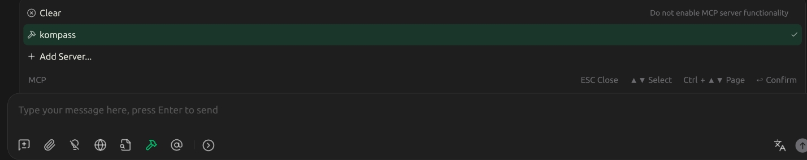

# Kompass
#### Manage your Kubernetes cluster with ease!
Kompass is an MCP server built to seamlessly connect with an AI model and deliver real-time, structured insights about the Kubernetes cluster under management. It is tailored for operators, SREs, and developers who primarily focus on monitoring, diagnostics, and small-scale adjustments within the cluster. Rather than attempting to automate or replace the human role, Kompass serves as a reliable companion: it enhances situational awareness, streamlines communication with the cluster, and produces consistent, well-structured reports. By acting as an intelligent assistant, Kompass helps users make informed decisions more quickly, reducing cognitive load while preserving full human oversight and control.

## Setup
### Server Installation
Kompass ships with a shell installer that prepares a fully isolated Python environment and writes a ready‑to‑use MCP client configuration file. This avoids manual setup and ensures the MCP client always launches Kompass with the correct paths and options.
**No installation is provided for Windows and MacOS**, at the moment.

To install Kompass, clone or download the Kompass project and move into the project directory.
Run the following command:
	
    chmod +x install.sh && bash install.sh

At the end of the run, the script writes an MCP configuration JSON file into the `config` directory, named `mcp.config.json`.
### Configuration
If you have already configured other MCP servers into clients like Claude Desktop, Cherry Studio, etc., you can copy or merge the `mcp.config.json` file content into your existing MCP client configuration.

If you are setting up an MCP client for the first time, refer to that client’s own documentation, as each MCP client has its own way of installing and managing MCP servers and configuration files. After importing the MCP server configuration into the MCP client, you may need to enable the server in the client.

For example, Cherry Studio offers *“Import from JSON”*, so you can paste the full content of `mcp.config.json`, generated by Kompass installation. After the JSON import, you have to enable Kompass into the agent chat.

